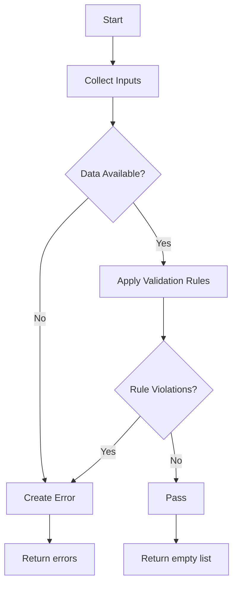

# White-Box CFG & Coverage Report

## Coverage Summary

| Validator Type | Statement Coverage | Branch Coverage |
|---|---:|---:|
| Currency | 100.0% (4/4) | 100.0% (4/4) |
| Untranslated Text | 100.0% (4/4) | 100.0% (4/4) |
| Date Format | 100.0% (4/4) | 100.0% (4/4) |
| Layout Direction | 100.0% (4/4) | 100.0% (4/4) |
| Text Overflow | 100.0% (3/3) | 100.0% (3/3) |
| Charset | 100.0% (4/4) | 100.0% (4/4) |
| Number & Measurement | 100.0% (4/4) | 100.0% (4/4) |
| Media & Alt | 100.0% (4/4) | 100.0% (4/4) |
| URL Routing | 100.0% (3/3) | 100.0% (3/3) |

## CFG Diagrams (Mermaid)

### Currency

### Untranslated Text

### Date Format

### Layout Direction

### Text Overflow

### Charset

### Number & Measurement

### Media & Alt

### URL Routing

